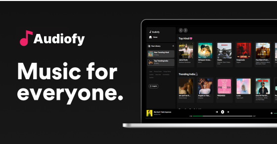

<h1 align="center">
  
</h1>

---

## 🎶 Welcome to Free Vibe

**Free Vibe** is a minimalistic and powerful music player designed to bring your favorite Spotify tracks right to your desktop browser. Built for music lovers who enjoy a smooth, distraction-free experience.

---

## ✨ Key Highlights

- 🔥 **Discover Trending Playlists** — Stay updated with the latest Spotify trends.
- 🎧 **Personalized Song Suggestions** — Get recommendations tailored to your vibe.
- 🎛️ **Simple Playback Controls** — Play, pause, skip, and repeat — all in one click.
- 🔊 **Volume Slider** — Adjust your sound perfectly with an easy control bar.
- 🖥️ **Fullscreen Mode** — Dive into a cinematic, immersive listening session.
- 📱 **Responsive Layout** — Primarily designed for desktop, but easily adaptable.

---

## 📷 Preview

---

